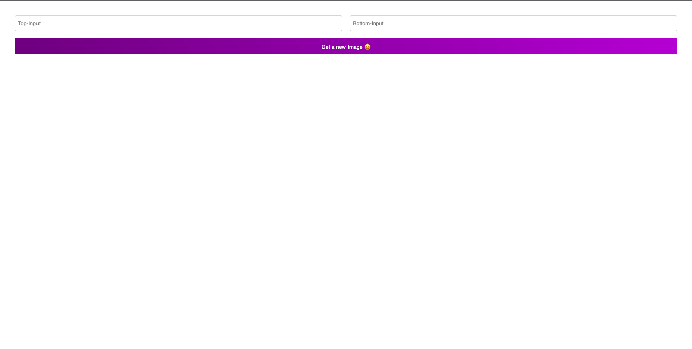

# Meme Generator APP

> A app to show you experiences on Airbnb.



- A visual representative of the form section.

## Built With

- JSX, CSS
- React

# Set Up
## Clone This Repository
```
$ git clone https://github.com/emmyobonyo/Meme-generator-collab.git
$ cd Meme-generator-collab
$ git checkout form
```

## Run Project
```
$ npm install
$ npm start
```

## Run APP in the Broswer
- Open [http://localhost:3000](http://localhost:3000) to view it in your browser.

## Original Figma file
- https://www.figma.com/file/IWGAEXAu0XZiqS71NkYtqW/Meme-Generator-(Copy)

## Authors
👤 **Emmanuel Obonyo**

- GitHub: [@emmyobonyo](https://github.com/emmyobonyo)
- Twitter: [@emmyobonyo](https://twitter.com/emmyobonyo)
- LinkedIn: [Emmanuel Obonyo](https://www.linkedin.com/in/emmanuel-obonyo-3728a2200/)
## 🤝 Contributing

Contributions, issues, and feature requests are welcome!

Feel free to check the [issues page](https://github.com/emmyobonyo/Meme-generator-collab/issues).

## Show your support

Give a ⭐️ if you like this project!
